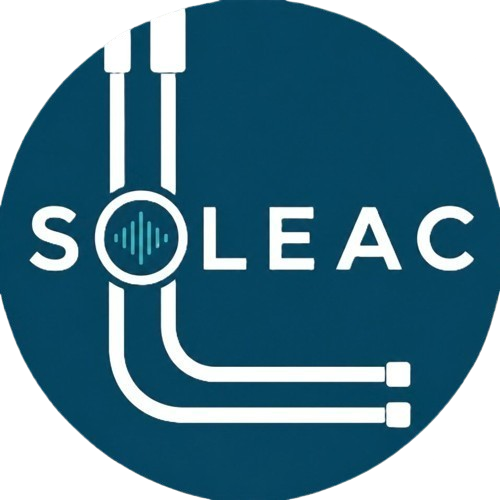

<!DOCTYPE html>
<html>
<head>
    <meta charset="UTF-8">

</head>
<body>
    <h1><strong>Soleac</strong></h1>

  
  &nbsp;&nbsp;&nbsp;&nbsp;
  

</body>
  <h2><strong>Organizacion de archivos</strong></h2>
<em><li><b>Carpeta de campo</b>/Progreso y documentacion </li>
<li><b>Diseño 3D</b>/Diseños fisicos de herraminetas</li>
<li><b>Firmware</b>/Codigos implementados a los microcontroladores</li>
<li><b>Hardware</b></Esquematicos y PCBs</li>
<li><b>Assets</b>/Logotipos, README lockup</li></em>

<body>
    <h2><strong>Que es Soleac y cómo funciona</strong></h2>
   <em><b>Soleac es un instrumento tecnologico detector de fugas de aire comprimido y gas. 
    Mediante receptores de frecuencia tales cómo:</b>
   <li>Microfono MEMS SPH0641LU4H-1</li>
    <li>MURATA ma40s4r</li>
<b>Podemos captar fugas en caños, ya que estas generan una frecuencia de entre 20khz y 80khz dependiendo el tamaño. Mediante el siguiente sensor:</b>
 <li>Sensor de gas MQ2</li>
 <b>Al acercar el instrumento, este sensor confirma si realmente hay una fuga, cabe aclarar que solo funciona sensando los siguientes gases:</b>
 <ul>
  <li>Gas Licuado de Petróleo</li>
  <li>Propano</li>
  <li>Metano</li>
  <li>Monóxido de carbono</li>
    <li>butano</li>
</ul>
<b>Si quisieras captar aire comprimido con este sensor, por ejemplo, no sirve y tendrias que usar los sensores de frecuencia.</b></em>

<body>
    <h2><strong>Porque existe Soleac</strong></h2>
    <em><b>El instrumento Soleac surge de tres problematicas actuales:</b> 
    La primera y mas importante es que solo existe una herramienta para los plomeros que les indique con precision donde hay una fuga sin tener que romper ni un ladrillo de pared, la problematica de esta herramienta es que es demasiado cara y ahi es donde entra soleac, presentando un precio que por lo menos este en el presupuesto de un plomero promedio. Llevando a estas herramientas detectores de fugas no solo a empresas grandes, si no tambien a empresas chicas y hogares.</em>

<body>
    <h2><strong>Modelo Soleac</strong></h2>

<body>
  <h2><strong>Componentes principales del proyecto</strong></h2>
  <em><li>Esp32 S3 Touch Lcd 3.5B</li>
  <li>Microfono MEMS SPH0641LU4H-1</li>
  <li>MURATA ma40s4r</li>
  <li>sensor de gas MQ2</li></em>
</body>

<body>
  <h3><strong>Contacto</strong></h3></body>

 

  <h3><strong>Otros proyectos</strong></h3></body>
    
